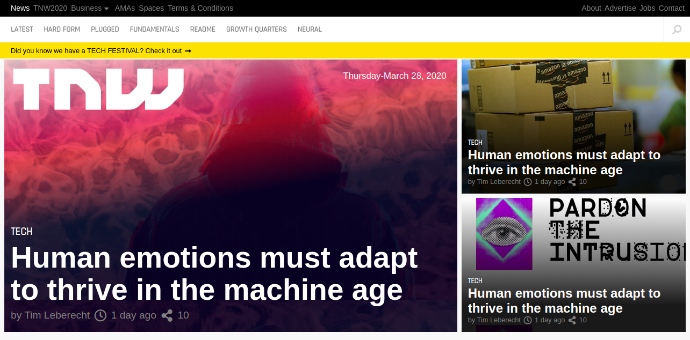

# The-Next-Web-Clone
This project involves cloning The Next Web, a tech-focused magazine which uses media queries to gracefully degrade their site as the window size is reduced.

[Live Demo](https://happy-agnesi-ff4a69.netlify.com/)

## Built With

- HTML
- CSS

## Author

- Github: [@mupa1](https://github.com/Mupa1)
- Twitter: [@mupa_mmbetsa](https://twitter.com/mupa_mmbetsa)
- Linkedin: [mupa-mmbetsa](https://www.linkedin.com/in/mupa-mmbetsa)

## 🤝 Contributing

Contributions, issues and feature requests are welcome!

Feel free to check the [issues page](https://github.com/Mupa1/The-Next-Web-Clone/issues)

## Show your support

Give a ⭐️ if you like this project!

## 📝 License

This project is [MIT](lic.url) licensed.
